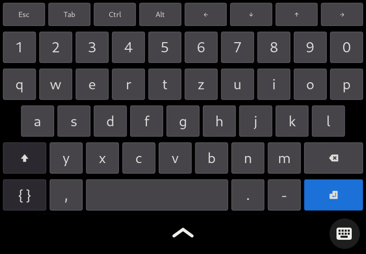
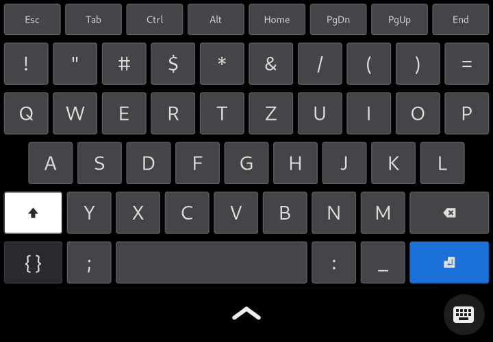
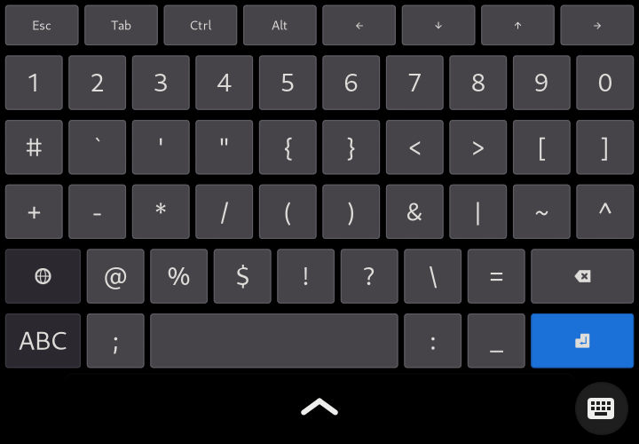

# squeekboard-term
A better terminal layout for squeekboard on the pinephone with phosh.
This layout is based on the [official terminal layout](https://source.puri.sm/Librem5/squeekboard/-/blob/master/data/keyboards/terminal/us.yaml).

## Installation

Copy **de.yaml** or **us.yaml** to **~/.local/share/squeekboard/keyboards/terminal**.

## Screenshots

